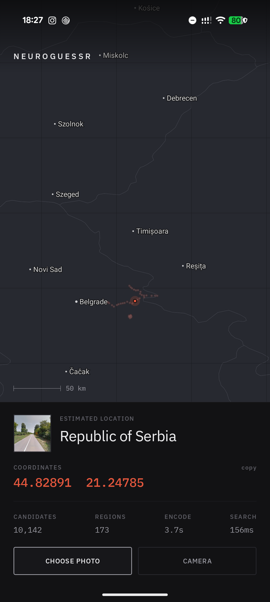

# NeuroGuessr

Point it at a photograph and it tells you where on Earth it was taken. Everything runs on the
phone — the neural encoder, the 300,000-place index, and the map. **The app never touches the
network.**



## What it does

A photograph goes in; a coordinate comes out, along with the other places the search considered.

1. A **DINOv3 ViT-L/16** backbone, contrastively fine-tuned for place recognition, turns the
   image into a 1024-dimensional descriptor and a 5,000-way "which region of the world" posterior.
2. The posterior **gates** the search down to the regions holding 95% of the probability mass —
   typically a few thousand candidates out of 300,000.
3. Those candidates are scored against four learned descriptor spaces plus a whitened raw
   descriptor, with a **CSLS hubness correction** and a log-prior term.
4. A **learned reranker** (16 features per candidate: similarity, rank, margin, geographic
   consensus among candidates, visual affinity, entropy) reorders the top 100.
5. The winner's coordinates are the answer.

## Accuracy

Measured on the full 2,998-image held-out validation set, running the exact quantised assets
the app ships with:

| index | median error | within 25 km | within 200 km | size |
|---|---|---|---|---|
| 1 view per location (default) | **44.4 km** | 43.0% | 73.9% | 1.55 GB |
| 4 views per location | **33.9 km** | 46.4% | 74.6% | 6.18 GB |

The 4-view figure matches the research pipeline's own 34.10 km, which means **int8 compression
of the index costs nothing measurable** — the entire gap between the two rows is the missing
three views per location, not quantisation.

The Kotlin port is verified bit-exact against the Python reference: 32/32 test images produce
an identical top-1 match, maximum divergence 0.000 km (`export/check_parity.py`).

## Speed

| | Pixel 10 Pro XL | Galaxy S21+ | S21+ thermally throttled |
|---|---|---|---|
| Encode | 3.7 s | 6.4 s | 14.9 s |
| Search (300k candidates) | 156 ms | 470 ms | 750 ms |
| Startup | 1.1 s | 1.7 s | 7.8 s |

Retrieval is not the bottleneck; the ViT-L forward pass is, and it scales directly with CPU
clock. The S21+ column is why: sustained inference heat-soaks an Exynos 2100 down to 533 MHz
from 2912 MHz, and everything slows by the same factor.

Two findings worth recording:

- **int8 quantisation of this model is unusable.** DINOv3 ViT-L carries a massive-activation
  channel peaking around 157,000 in its residual stream. Per-tensor dynamic int8 quantisation
  collapses descriptor similarity to the index from 0.989 to 0.596, and the whitened space to
  0.12. The same outlier overflows fp16 and produces NaN on a naive `.half()` export.
- **fp16 works perfectly if the residual stream stays fp32.** Storing all 156 linear layers in
  fp16 while keeping LayerNorms, the residual path and the patch-embedding convolution in fp32
  gives accuracy identical to fp32 at half the size (652 MB vs 1.3 GB). That is what ships.

## Layout

```
android/                  Kotlin + Compose app
  IndexStore.kt           mmap of the packed index, segmented past 2 GB
  Encoder.kt              ONNX Runtime session (XNNPACK, 4 threads)
  Preprocess.kt           Pillow-compatible bicubic resize — see below
  Retrieval.kt            gate, blend, CSLS, top-K, the reranker
  MapCanvas.kt            offline vector map, gestures, labels
  WorldMap.kt             Natural Earth binary reader
export/                   asset pipeline (run against the research repo)
  build_index_assets.py   descriptors -> int8, cell-sorted, mmap-friendly
  export_encoder.py       LoRA merge -> ONNX -> verification
  export_fp16.py          the fp16 export described above
  fit_e7.py               fits the reranker and scores the full validation set
  check_parity.py         phone vs desktop, on identical inputs
  build_map_assets.py     Natural Earth -> world.bin
  provision_device.sh     install + push assets to a device
```

`Preprocess.kt` reimplements Pillow's bicubic resampler by hand. Android's
`Bitmap.createScaledBitmap` is bilinear, and the resulting descriptor drifts away from the one
the index was built with — a retrieval error, not a cosmetic one.

## Running it

The APK is on the [releases page](../../releases). It needs the index and encoder pushed
separately, because together they are 2.2 GB:

```bash
export/provision_device.sh [device-serial]
```

Install order matters: a **first** install wipes the app's external files directory, so the
assets must go on afterwards. Re-installs over an existing app leave them alone. The script
handles this, checks free space, and is safe to re-run.

Building from source needs the Android SDK and a JDK; no Android Studio required:

```bash
cd android && ./gradlew assembleDebug
```

Regenerating the assets requires the research repo (the cached descriptors and checkpoints
live there) — `export/build_index_assets.py` then `export/export_fp16.py`.

## Licences

See [NOTICE.md](NOTICE.md). In short: the DINOv3 weights are under Meta's DINOv3 licence, which
permits commercial use and redistribution provided the licence travels with any derivative;
IBM Plex is SIL OFL; Natural Earth is public domain. The place index is derived from Street
View imagery and is **not** distributed here.
